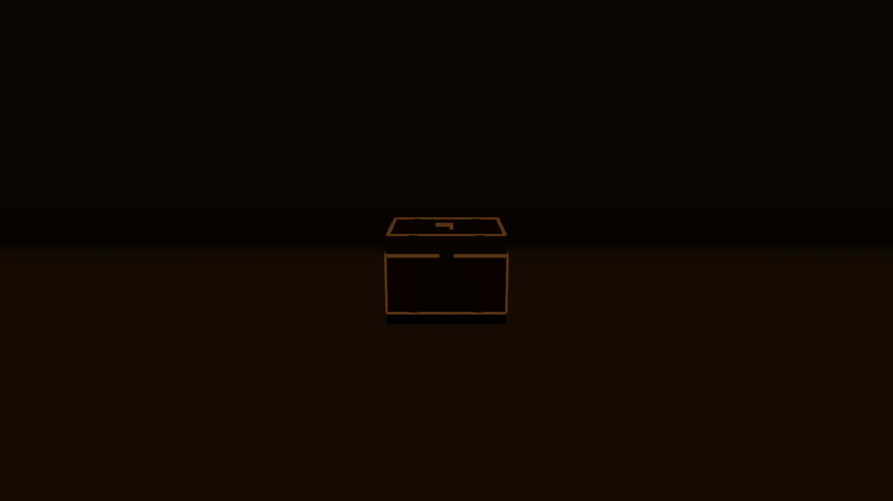
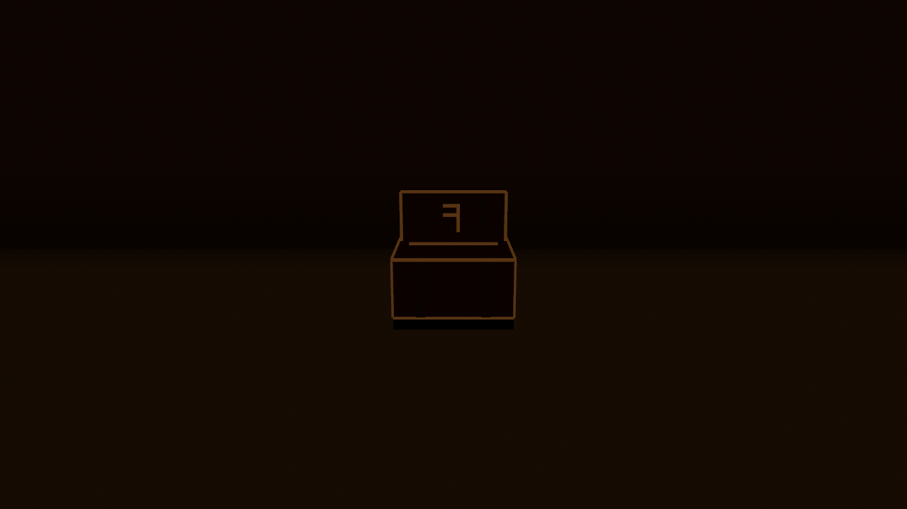

# Chest readability acceptance — issue #1315

Visual acceptance **passed** after inspecting both original PNGs from
[remote capture run 36453791986](https://github.com/FabioSM46/voxelheim-v2/actions/runs/36453791986).
The captured production source is `5095bcb247ae2f49a854bef55e168d141a9c2395`, the merge of
[#1349](https://github.com/FabioSM46/voxelheim-v2/pull/1349), following the interaction and
capture implementation in [#1348](https://github.com/FabioSM46/voxelheim-v2/pull/1348).

The standing camera is exactly **five blocks** from the sand-hall chest centre. Both
1280×720 images use the same camera, world tick 6000, AcesFitted tonemapping and production
cave lighting. Mesa llvmpipe rendered them through Vulkan on the manual remote runner.
Seven server-authored sconces were loaded, with three active point lights. The dungeon
gates are open in both fixtures; that fixture flag is separate from the chest's state.

## Closed chest

The low horizontal lid, its flattened maker's mark and the box corners are identifiable
against the dim sand hall. The amber rim outlines the shut lid; the wooden surfaces remain
dark rather than receiving artificial illumination for the capture.

## Open chest

The raised vertical lid and upright maker's mark are clearly different from the closed
state. The rim separates the dark open recess from the lid and body. The amber inlays
provide the visibility; this is not a claim that the unlit wood grain is readable.

## Result history and scope

The first [capture run 36450141868](https://github.com/FabioSM46/voxelheim-v2/actions/runs/36450141868),
at source `3964691d9597cd8cff3f50497fdab2088159e9b7`, completed but **failed visual acceptance**:
the chest was almost black and the two lid silhouettes were barely distinguishable.
The central chest is outside the wall sconces' nine-block range. The production sand grade
also removes sunlight and lowers ambient illumination; the rendering was working as configured.

The correction added thin amber inlays to the production chest mesh through the existing
shared unlit rune material. The wood remains in the ordinary lit terrain pass. No room
light, camera, exposure or capture-only enhancement changed between the two runs. The
second run made the requested closed/open distinction readable at the specified distance.

This record verifies the two fixed views at the source above. It does not establish
performance, benchmark improvement, hardware parity or readability at arbitrary distances.
Diagnostic draw counts from separate runs are not a benchmark and are omitted from the
published provenance. Functional interaction, server authority, refusal text and reopening
behavior are implemented and covered by the source changes in #1348; these still images
specifically verify the visual criterion.

## Provenance and integrity

The PNGs are unchanged copies from artifact
`chest-visual-5095bcb247ae2f49a854bef55e168d141a9c2395`; they were not cropped, recolored or
brightened. Their SHA-256 digests were checked against the artifact before publication.
[SHA256SUMS](SHA256SUMS) allows that check against the committed copies.
[provenance.json](provenance.json) records the run, source, image digests, server fixture and
snapshot digests, camera coordinates, lighting counts and software adapter. It contains
selected public capture metadata, not workstation paths or runner logs. The fixture and
snapshot sources agree with the captured commit, and each snapshot names its fixture hash.

The original raw fixture binaries are reproducible through the
[manual capture procedure](../../CHEST_CLIENT_CAPTURE.md). The workflow validated the
requested Chest/ChestOpen block before rendering each state. No local tests, builds or
rendering were used to produce this acceptance record.
